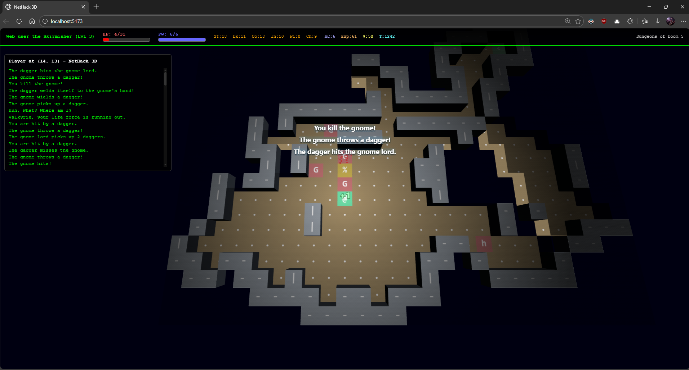
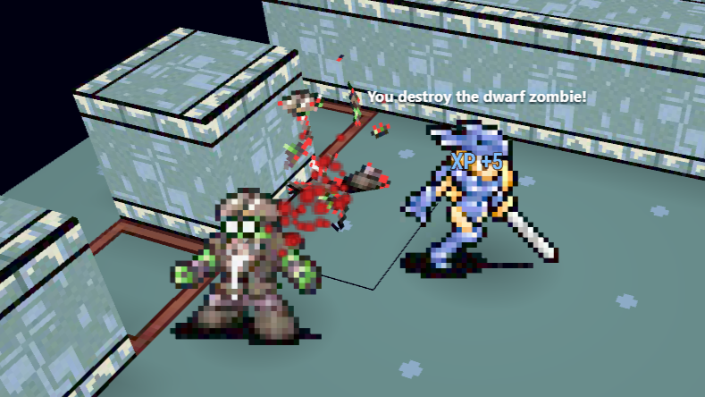
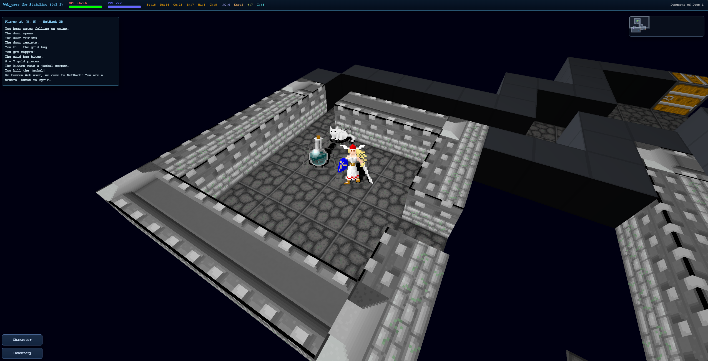

# NetHack 3D

Play in browser: https://jamesiv4.github.io/nethack-3d/

## Windows and Android App

[Download the latest release](https://github.com/JamesIV4/nethack-3d/releases/latest)

## iOS App

On iPhone/iPad, open the play link in Safari, tap the Share button, then tap `Add to Home Screen`.
Launch it from your Home Screen for a web app fullscreen experience.

NetHack 3D lets you play classic NetHack in a fully interactive 3D dungeon, in your browser, phone or desktop PC.

## Steam Deck (SteamOS) / Linux AppImage

1. [Download the latest Linux release](https://github.com/JamesIV4/nethack-3d/releases/latest) from the Releases page.
2. Copy `NetHack 3D <version>.AppImage` from `release/` to your Linux machine.
3. Add the AppImage directly to Steam using "Add Non-Steam Game to My Library".
4. Keep Steam compatibility/proton disabled for this native Linux launch path.
5. Linux launch option notes:
   - `--windowed`: launch in a normal framed window instead of fullscreen.
   - `--borderless`: launch in a frameless non-fullscreen window that covers the display without using native fullscreen mode.
6. Recommended Steam Input profile tweak: Set left trackpad to Left Joystick, and trackpad click to the A button. Movement and common actions are very simple this way!

## Gameplay video link:

## Screenshots

| Combat in the Gnomish Mines                                                                                            | Shatter monsters into pieces!                                                                                |
| ---------------------------------------------------------------------------------------------------------------------- | ------------------------------------------------------------------------------------------------------------ |
|  |  |
| **Multiple tile sets**                                                                                                 | **Beautiful UI**                                                                                             |
|                                 |                 |

## Current Features

- Play NetHack 3.6.7 in a 3D dungeon view while keeping core game rules and depth.
- Mix and match gameplay modes: classic top-down or first-person (FPS) modes with ASCII, tiles, or Vulture graphics.
- Combat feedback effects: Monsters dynamically shatter into bloody pieces, different every time.
- Full sound support. Monsters die with a satisfying crunch.
- Customize sound to your liking and create your own sound packs directly in-game.
- Play on the couch with full controller support. Radial wheel for actions, move confirmation for careful roguelike navigation.
- Scalable minimap for level awareness, with viewport box and drag-to-center camera navigation.
- Optional floating damage/heal numbers, status changes, XP, blood mist combat particles.
- Camera panning and rotation.
- Crisp ASCII monsters and items are supported in addition to tiles.
- Built-in graphical tilesets: Vulture tiles, Absurdly Evil, DawnHack, NetHack Modern, Nevanda, RZTiles, and Vanilla NetHack Tiles.
- Upload and manage your own custom tilesets directly in-game.
- Tileset background removal tools built-in.
- Dynamic lighting around the player.
- Full HUD with level, health, power, stats, armor, gold, hunger, experience, time, and dungeon branch and depth.
- Vulture tiles mode simulates the isometric Vulture graphics style but in full 3D, including FPS support.
- Live message log plus on-screen message popups.
- Full mobile touch support (or even in desktop if you want).
- Beautiful menus: item category headers, keyboard tips, multi-pickup selection, and menu paging.
- Fast character start: random hero or create a character (name, role, race, gender, alignment), saved for your next run too.
- Customize your NetHack initialization options: explore mode, autopickup, pet names and other advanced settings.
- Save and load your game. Perfect for long runs.
- Autofill on extended commands with `#` so advanced playstyles are easy to manage, plus all commands available via buttons on mobile.
- Desktop-friendly controls: keyboard-first with mouse support for map interaction and camera control.
- Mobile-friendly controls: tap/swipe movement, quick actions, extended command sheet, mobile log view, and FPS touch-look/touch-run gestures.
- Inventory context actions for common item interactions without typing command sequences.
- Options to tweaks just about everything to your liking.

## Run Locally

1. `npm i`
2. `npm run dev`
3. Open `http://localhost:5173/`

## Scripts

- `npm run dev` - Start Vite dev server.
- `npm run build` - Build production bundles.
- `npm run build:electron` - Build bundles with Electron-safe relative asset paths.
- `npm run preview` - Preview production build locally.
- `npm run electron:dev` - Run Electron against the Vite dev server.
- `npm run electron:dist:win` - Build and package a Windows NSIS `.exe` installer (x64) to `release/`.
- `npm run electron:dist:win:portable` - Build and package a portable Windows `.exe` (x64) to `release/`.
- `npm run electron:dist:linux:appimage` - Build and package a Linux AppImage (x64) to `release/` (uses WSL automatically on Windows, stages Linux runtime deps, and includes Linux icon assets).
- `npm run android:add` - Create the native Android project with Capacitor (run once).
- `npm run android:sync` - Build web assets and sync them into the Android project.
- `npm run android:open` - Open the Android project in Android Studio.
- `npm run android:run` - Build web assets and run on a connected Android device/emulator.
- `npm run updates:package` - Create `build/client-updates/manifest.json` + build payload from `dist/` for in-app client updates.
- `npm run update` - Build + package the latest client-update payload in one command.
- `npm run glyphs:generate` - Regenerate glyph catalog from runtime artifacts.
- `npm run glyphs:check` - Verify checked-in glyph catalog is up to date.

## Client Update Pipeline

- Startup update checks are enabled for packaged Electron and Capacitor Android clients.
- The app reads `build/client-updates/manifest.json` (or `VITE_NH3D_UPDATE_MANIFEST_URL` when set), prompts users when updates are available, and can download/apply the latest packaged web build.
- Update payloads are generated by `scripts/updates/prepare-client-update.mjs`, which copies `dist/` into `build/client-updates/latest/` (rolling state) and writes SHA-verified file metadata.
- Update channel switches live in `scripts/updates/channel-config.json`:
  - Set `requireClientUpgrade` to `true` to force a full native client upgrade warning while still allowing web build download.
  - Use `clientUpgradeMessage` for custom upgrade guidance text shown in the startup update dialog.
- Update packaging is intentional/manual:
  - Run `npm run update` when you want to prepare and publish a new online update from current source.

## Architecture

- Main app bootstrap/debug helpers: `src/app.ts`
- React entry: `src/main.tsx`
- React UI shell: `src/ui/App.tsx`
- 3D engine and client-side interaction: `src/game/Nethack3DEngine.ts`
- Glyph catalog + behavior rules: `src/game/glyphs/*`
- Runtime worker bridge: `src/runtime/WorkerRuntimeBridge.ts`
- Worker runtime host: `src/runtime/runtime-worker.ts`
- NetHack callback adapter/state machine: `src/runtime/LocalNetHackRuntime.ts`

## GitHub Pages Deploy

1. Push this repo to GitHub.
2. In repository settings, go to `Settings > Pages`.
3. Set `Source` to `GitHub Actions`.
4. Ensure your deploy branch matches `.github/workflows/deploy-gh-pages.yml` (`main` by default).
5. Push to `main` (or run the workflow manually).

The workflow builds with Vite and deploys the `dist/` folder.
