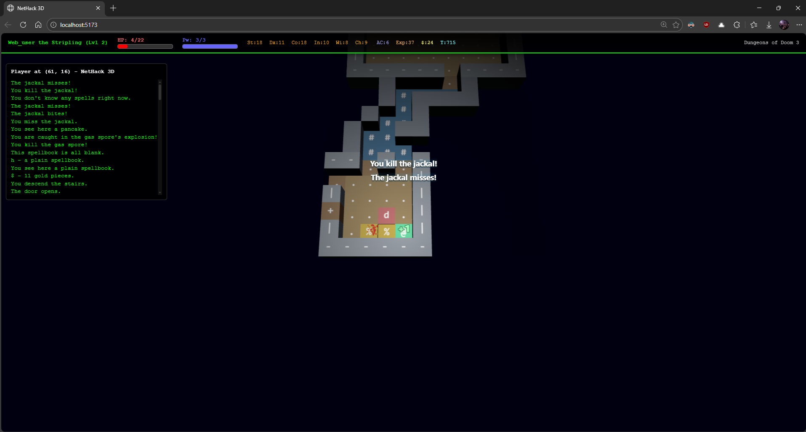
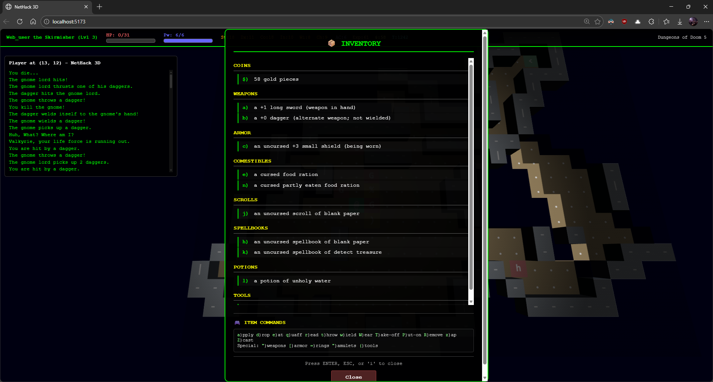

# NetHack 3D

Play in browser: https://jamesiv4.github.io/nethack-3d/

## iOS App

On iPhone/iPad, open the play link in Safari, tap the Share button, then tap `Add to Home Screen`.
Launch it from your Home Screen for a web app fullscreen experience.

NetHack 3D lets you play classic NetHack in a fully interactive 3D dungeon, in your browser, phone or desktop PC.

## Gameplay video link:

## Screenshots (outdated)

| Combat (Gnomish Mines)                                                                                                                                                                                                   | Enhanced Combat Visuals (Tile shake, damage numbers, blood)                                                            |
| ------------------------------------------------------------------------------------------------------------------------------------------------------------------------------------------------------------------------ | ---------------------------------------------------------------------------------------------------------------------- |
|  |  |
| Attributes                                                                                                                                                                                                               | Inventory                                                                                                              |
|                     |                        |

## Current Features

- Play NetHack in a 3D dungeon view while keeping core game rules and depth.
- Two play styles: classic top-down and first-person (FPS) mode.
- Minimap for full-level awareness, with viewport box and drag-to-center camera navigation.
- Camera panning and rotation.
- Crisp ASCII monsters and items.
- Built-in graphical tilesets: Absurdly Evil, DawnHack, NetHack Modern, Nevanda, and Vanilla NetHack Tiles.
- Upload and manage your own custom tilesets directly in-game.
- Per-tileset background cleanup controls (tile selection, chroma key, and removal mode tuning).
- Dynamic darkness and lighting around your hero.
- Combat feedback effects (screen-space and tile effects)
- Optional floating damage/heal numbers and blood mist combat particles.
- Full HUD with level, health, power, stats, armor, gold, hunger, experience, time, and dungeon depth.
- Live message log plus on-screen message popups
- Full mobile touch support for NetHack prompts: yes/no, directional actions, text entry, and tile targeting/look mode.
- Beautiful menus: item category headers, keyboard tips, multi-pickup selection, and menu paging.
- Fast character start: random hero or manual setup (name, role, race, gender, alignment).
- Extended command support with `#` so advanced playstyles are available, with all commands available via buttons on mobile.
- Desktop-friendly controls: keyboard-first with mouse support for map interaction and camera control.
- Mobile-friendly controls: tap/swipe movement, quick actions, extended command sheet, mobile log view, and FPS touch-look/touch-run gestures.
- Inventory context actions for common item interactions without typing command sequences.
- Adjustable client options including FPS FOV, look sensitivity, inverted look, antialiasing, and minimap visibility.

## Run Locally

1. `npm i`
2. `npm run dev`
3. Open `http://localhost:5173/`

## Scripts

- `npm run dev` - Start Vite dev server.
- `npm run build` - Build production bundles.
- `npm run build:electron` - Build bundles with Electron-safe relative asset paths.
- `npm run preview` - Preview production build locally.
- `npm run electron:dev` - Run Electron against the Vite dev server.
- `npm run electron:dist:win` - Build and package a Windows NSIS `.exe` installer (x64) to `release/`.
- `npm run electron:dist:win:portable` - Build and package a portable Windows `.exe` (x64) to `release/`.
- `npm run android:add` - Create the native Android project with Capacitor (run once).
- `npm run android:sync` - Build web assets and sync them into the Android project.
- `npm run android:open` - Open the Android project in Android Studio.
- `npm run android:run` - Build web assets and run on a connected Android device/emulator.
- `npm run glyphs:generate` - Regenerate glyph catalog from runtime artifacts.
- `npm run glyphs:check` - Verify checked-in glyph catalog is up to date.

## Architecture

- Main app bootstrap/debug helpers: `src/app.ts`
- React entry: `src/main.tsx`
- React UI shell: `src/ui/App.tsx`
- 3D engine and client-side interaction: `src/game/Nethack3DEngine.ts`
- Glyph catalog + behavior rules: `src/game/glyphs/*`
- Runtime worker bridge: `src/runtime/WorkerRuntimeBridge.ts`
- Worker runtime host: `src/runtime/runtime-worker.ts`
- NetHack callback adapter/state machine: `src/runtime/LocalNetHackRuntime.ts`

## GitHub Pages Deploy

1. Push this repo to GitHub.
2. In repository settings, go to `Settings > Pages`.
3. Set `Source` to `GitHub Actions`.
4. Ensure your deploy branch matches `.github/workflows/deploy-gh-pages.yml` (`main` by default).
5. Push to `main` (or run the workflow manually).

The workflow builds with Vite and deploys the `dist/` folder.
